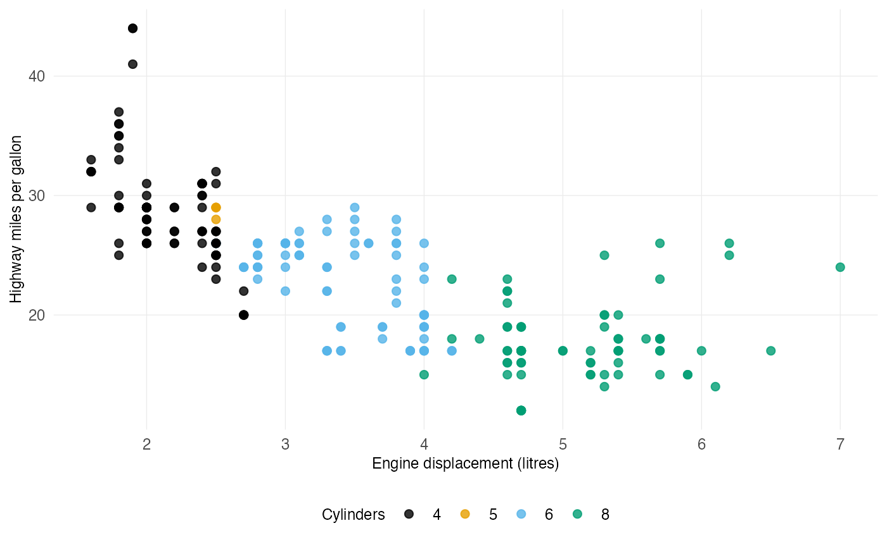

# Getting started with figspec

[`library`](https://rdrr.io/r/base/library.html)`(`[`ggplot2`](https://ggplot2.tidyverse.org)`)`` `[`library`](https://rdrr.io/r/base/library.html)`(`[`figspec`](https://dansemakula.github.io/figspec/)`)`

## Choose the requirements for your figure or table

A clear and accurate figure or table may still need changes before it
can be submitted, published or placed in a report. A figure may be too
wide, have too few pixels for print or contain text that will be
unreadable at its final size. A table may need to remain editable, use a
particular page orientation or follow rules for type and borders.
Figures saved at the same width can also look uneven when their plotting
areas do not line up.

Start by providing figspec with the requirements or specifications for
the finished work. You can do this in three ways:

- **Use an existing publication profile.** Select your intended journal
  or publisher from figspec’s registry. figspec loads the recorded
  requirements and shows where they came from and when they were last
  verified.
- **Write and use your own requirements.** Create a specification for a
  report, presentation, thesis, organisation or production workflow in a
  named R list. You can use it immediately or save it for reuse.
- **Set the required dimensions directly.** Give the exact image or
  plotting-panel size when size is the only constraint.

Whichever route you take, the workflow is the same: define the
requirements → build the figure or table to meet them → export it
correctly → verify the finished file → repeat when the work or its
requirements change.

### Using your own requirements

For your own project, write the requirements in a named R list. Here, a
quarterly report accepts PNG or PDF figures that are 160 mm wide, at
least 300 dpi, with text no smaller than 9 pt and lines no thinner than
0.5 pt:

`report_spec`` ``<-`` `[`list`](https://rdrr.io/r/base/list.html)`(`` `` name ``=`` ``"Quarterly outcomes report"``,`` `` columns ``=`` `[`list`](https://rdrr.io/r/base/list.html)`(``full ``=`` ``160``)``,`` `` formats ``=`` `[`c`](https://rdrr.io/r/base/c.html)`(``"png"``, ``"pdf"``)``,`` `` dpi_min ``=`` ``300``,`` `` font_min_pt ``=`` ``9``,`` `` min_line_pt ``=`` ``0.5`` ``)`

Use `report_spec` wherever a function asks for a specification,
including
[`fig_apply_spec()`](https://dansemakula.github.io/figspec/reference/fig_apply_spec.md),
[`theme_spec()`](https://dansemakula.github.io/figspec/reference/theme_spec.md),
[`fig_check()`](https://dansemakula.github.io/figspec/reference/fig_check.md)
and
[`fig_save()`](https://dansemakula.github.io/figspec/reference/fig_save.md).
Those functions accept either a registry name or your own list, so no
journal is required.

To use the same requirements in a later R session, save them in a
project YAML file and load that file when the project starts:

`project_spec_file`` ``<-`` `[`file.path`](https://rdrr.io/r/base/file.path.html)`(`[`tempdir`](https://rdrr.io/r/base/tempfile.html)`(``)``, ``"project-specifications.yml"``)`` `` `[`spec_save`](https://dansemakula.github.io/figspec/reference/spec_save.md)`(`` `` ``report_spec``,`` `` ``project_spec_file``,`` `` id ``=`` ``"quarterly_outcomes_report"`` ``)`` `[`spec_load`](https://dansemakula.github.io/figspec/reference/spec_load.md)`(``project_spec_file``)`` `` ``saved_report_spec`` ``<-`` `[`spec_get`](https://dansemakula.github.io/figspec/reference/spec_get.md)`(``"quarterly_outcomes_report"``)`` `[`fig_width`](https://dansemakula.github.io/figspec/reference/fig_width.md)`(``saved_report_spec``, ``"full"``)`` ``#> [1] 160`

In a real project, use a path such as `"project-specifications.yml"` and
keep the file with the analysis.
[`spec_save()`](https://dansemakula.github.io/figspec/reference/spec_save.md)
creates or updates the file safely;
[`spec_load()`](https://dansemakula.github.io/figspec/reference/spec_load.md)
makes its entries available in the current session. Users do not need to
change figspec or add files to the installed package.

A **specification** lists the requirements the finished work must meet.
A **house style** sets visual choices, such as a reusable ggplot2 theme.
They can be used together, but they are kept separate so a preferred
appearance is not mistaken for a requirement. Use
[`style_register()`](https://dansemakula.github.io/figspec/reference/style_register.md)
to name that appearance for the current session and
[`style_save()`](https://dansemakula.github.io/figspec/reference/style_save.md)
to keep it for later sessions.

### Reusing your own requirements and visual styles

The two kinds of reusable addition serve different purposes:

| If you want to reuse… | It should contain… | Save and restore it with… |
|----|----|----|
| A specification | Requirements that a finished figure or table must meet | [`spec_save()`](https://dansemakula.github.io/figspec/reference/spec_save.md) and [`spec_load()`](https://dansemakula.github.io/figspec/reference/spec_load.md) |
| A house style | Preferred ggplot2 appearance, such as the theme, grid and legend position | [`style_save()`](https://dansemakula.github.io/figspec/reference/style_save.md) and [`style_load()`](https://dansemakula.github.io/figspec/reference/style_load.md) |

Specifications are saved as readable YAML. House styles are saved as RDS
because they contain R theme objects. For example, the report
specification above has already been saved and loaded. A visual style
can be preserved in a separate file:

[`style_register`](https://dansemakula.github.io/figspec/reference/style_register.md)`(`` `` ``"quarterly_report"``,`` `` `[`theme_minimal`](https://ggplot2.tidyverse.org/reference/ggtheme.html)`(``)`` ``+`` `` `[`theme`](https://ggplot2.tidyverse.org/reference/theme.html)`(`` `` panel.grid.minor ``=`` `[`element_blank`](https://ggplot2.tidyverse.org/reference/element.html)`(``)``,`` `` legend.position ``=`` ``"bottom"`` `` ``)``,`` `` description ``=`` ``"Quarterly report figures"`` ``)`` `` ``project_style_file`` ``<-`` `[`file.path`](https://rdrr.io/r/base/file.path.html)`(`[`tempdir`](https://rdrr.io/r/base/tempfile.html)`(``)``, ``"project-figure-styles.rds"``)`` `[`style_save`](https://dansemakula.github.io/figspec/reference/style_save.md)`(``project_style_file``)`` `[`style_remove`](https://dansemakula.github.io/figspec/reference/style_remove.md)`(``"quarterly_report"``)`` `[`style_load`](https://dansemakula.github.io/figspec/reference/style_load.md)`(``project_style_file``)`` `[`style_list`](https://dansemakula.github.io/figspec/reference/style_list.md)`(``)``[`[`style_list`](https://dansemakula.github.io/figspec/reference/style_list.md)`(``)``$``name`` ``==`` ``"quarterly_report"``, ``]`` ``#> name description`` ``#> 1 quarterly_report Quarterly report figures`

Once both files have been loaded, their names can be combined whenever a
plot is built:

[`ggplot`](https://ggplot2.tidyverse.org/reference/ggplot.html)`(``ggplot2``::`[`mpg`](https://ggplot2.tidyverse.org/reference/mpg.html)`, `[`aes`](https://ggplot2.tidyverse.org/reference/aes.html)`(``displ``, ``hwy``, colour ``=`` `[`factor`](https://rdrr.io/r/base/factor.html)`(``cyl``)``)``)`` ``+`` `` `[`geom_point`](https://ggplot2.tidyverse.org/reference/geom_point.html)`(``size ``=`` ``2``, alpha ``=`` ``0.8``)`` ``+`` `` `[`labs`](https://ggplot2.tidyverse.org/reference/labs.html)`(`` `` x ``=`` ``"Engine displacement (litres)"``,`` `` y ``=`` ``"Highway miles per gallon"``,`` `` colour ``=`` ``"Cylinders"`` `` ``)`` ``+`` `` `[`fig_apply_spec`](https://dansemakula.github.io/figspec/reference/fig_apply_spec.md)`(`` `` ``"quarterly_outcomes_report"``,`` `` style ``=`` ``"quarterly_report"`` `` ``)`



For a project or research team, a simple layout is:

```
project/
├── config/
│   └── figspec/
│       ├── specifications.yml
│       └── styles.rds
└── analysis.R
```

Load the files at the beginning of an analysis, in a project setup
script or in the first code chunk of an R Markdown or Quarto document:

[`library`](https://rdrr.io/r/base/library.html)`(`[`figspec`](https://dansemakula.github.io/figspec/)`)`` `` `[`spec_load`](https://dansemakula.github.io/figspec/reference/spec_load.md)`(`[`file.path`](https://rdrr.io/r/base/file.path.html)`(``"config"``, ``"figspec"``, ``"specifications.yml"``)``)`` `[`style_load`](https://dansemakula.github.io/figspec/reference/style_load.md)`(`[`file.path`](https://rdrr.io/r/base/file.path.html)`(``"config"``, ``"figspec"``, ``"styles.rds"``)``)`

These paths are relative to the project directory, so they work on every
team member’s computer even when the project is stored in a different
location.

Each team member has a separate R installation and a separate local copy
of the project. Git records changes to the project files, while GitHub
or another Git hosting service stores the shared repository. The team
shares the figspec setup in the same way that it shares analysis code:

1.  Add `.Rprofile`, `config/figspec/specifications.yml` and
    `config/figspec/styles.rds` to the project repository.
2.  Commit the files and push the commit to GitHub.
3.  Each team member clones the repository to their computer the first
    time they join the project.
4.  When someone updates a specification or style, they commit and push
    the change. Other team members pull it into their own project copy.
5.  When a team member opens the project, their own R installation reads
    the local `.Rprofile` and loads the local copies of the
    specification and style files.
6.  If a team member pulls an update while R is already running, they
    restart R or run
    [`spec_load()`](https://dansemakula.github.io/figspec/reference/spec_load.md)
    and
    [`style_load()`](https://dansemakula.github.io/figspec/reference/style_load.md)
    again.

The team is not sharing one running copy of R, and `.Rprofile` is not
sent directly from one computer to another. GitHub holds the shared
project files; Git places a copy on each team member’s computer. Every
computer must have figspec installed. A project that uses `renv` can
also record the package version so that the team uses the same release.

An explicit setup script is usually easiest to see and debug. If every R
session in the project should load the files automatically, put the
following in the project’s `.Rprofile`:

`if`` ``(`[`requireNamespace`](https://rdrr.io/r/base/ns-load.html)`(``"figspec"``, quietly ``=`` ``TRUE``)``)`` ``{`` `` ``specification_file`` ``<-`` `[`file.path`](https://rdrr.io/r/base/file.path.html)`(`` `` ``"config"``, ``"figspec"``, ``"specifications.yml"`` `` ``)`` `` ``style_file`` ``<-`` `[`file.path`](https://rdrr.io/r/base/file.path.html)`(``"config"``, ``"figspec"``, ``"styles.rds"``)`` `` `` ``if`` ``(`[`file.exists`](https://rdrr.io/r/base/files.html)`(``specification_file``)``)`` ``{`` `` ``figspec``::`[`spec_load`](https://dansemakula.github.io/figspec/reference/spec_load.md)`(``specification_file``)`` `` ``}`` `` ``if`` ``(`[`file.exists`](https://rdrr.io/r/base/files.html)`(``style_file``)``)`` ``{`` `` ``figspec``::`[`style_load`](https://dansemakula.github.io/figspec/reference/style_load.md)`(``style_file``)`` `` ``}`` ``}`

Because `.Rprofile` contains R code that runs when the project starts,
review changes to it before accepting them and never store passwords,
access tokens or other secrets in it. Load an RDS style file only from a
repository controlled by people you trust. Stored theme functions are
blocked by default and require the explicit `allow_functions = TRUE`
option.

An organisation with many specifications, styles and helper functions
can put them in a small internal R package that imports figspec. That is
the most maintainable way to provide a larger shared extension across
many projects.

For exact panel sizing without any specification, see the [panel-sizing
guide](https://dansemakula.github.io/figspec/articles/panels.md). It
demonstrates why equal image widths do not guarantee equal plotting
areas and how to make a set align.

## Using a journal or publisher profile

Journals and publishers make a useful example because they give exact
measurements and do not all use the same ones. Cell Press asks for
widths of 85, 114 or 174 mm and type between 6 and 8 pt. Science uses
widths of 57, 121 or 184 mm and type no smaller than 5 pt. PNAS caps
type at 12 pt, while Nature and the Royal Society use different
panel-label styles.

Each publisher is designing a different page, so the differences are
reasonable. The difficulty is that a normal ggplot gives no warning when
a figure breaks one of these rules. The problem may only be discovered
after submission or during production.

## Apply the requirements while you build

It is easier to make changes while the plot is still editable. Add a
publication profile much like a ggplot2 scale:

`fitted`` ``<-`` `[`ggplot`](https://ggplot2.tidyverse.org/reference/ggplot.html)`(``ggplot2``::`[`mpg`](https://ggplot2.tidyverse.org/reference/mpg.html)`,`` `` `[`aes`](https://ggplot2.tidyverse.org/reference/aes.html)`(``displ``, ``hwy``, colour ``=`` `[`factor`](https://rdrr.io/r/base/factor.html)`(``cyl``)``, shape ``=`` `[`factor`](https://rdrr.io/r/base/factor.html)`(``cyl``)``)``)`` ``+`` `` `[`geom_point`](https://ggplot2.tidyverse.org/reference/geom_point.html)`(``size ``=`` ``2.1``, alpha ``=`` ``0.8``, stroke ``=`` ``0.6``)`` ``+`` `` `[`labs`](https://ggplot2.tidyverse.org/reference/labs.html)`(``title ``=`` ``"Engine size and highway fuel economy"``,`` `` x ``=`` ``"Engine displacement (litres)"``, y ``=`` ``"Highway miles per gallon"``,`` `` colour ``=`` ``"Cylinders"``, shape ``=`` ``"Cylinders"``)`` ``+`` `` `[`fig_apply_spec`](https://dansemakula.github.io/figspec/reference/fig_apply_spec.md)`(``"cell_press"``)`` `` ``report`` ``<-`` `[`fig_check`](https://dansemakula.github.io/figspec/reference/fig_check.md)`(``fitted``, ``"cell_press"``, column ``=`` ``"single"``)`` ``knitr``::`[`kable`](https://rdrr.io/pkg/knitr/man/kable.html)`(``report``[``, `[`c`](https://rdrr.io/r/base/c.html)`(``"check"``, ``"actual"``, ``"status"``)``]``, row.names ``=`` ``FALSE``)`

| check | actual | status |
|:---|:---|:---|
| Width | 85 mm | pass |
| Height | could not determine | unknown |
| Resolution | could not determine | unknown |
| File format | could not determine | unknown |
| Type size | smallest 6 pt, largest 7.5 pt | pass |
| Font | could not determine | unknown |
| Line width | could not determine | unknown |
| Colour mode | RGB | pass |
| Colour pairs | no red/green pairing | pass |
| Greyscale | 1 pair(s) merge in greyscale: \#56B4E9/#E69F00 | unspecified |
| Colour vision | separable under deuteranopia, protanopia and tritanopia | unspecified |
| Redundant coding | colours merge in greyscale but 4 shapes still separate the series | unspecified |
| Text case | 5 label(s), not checked | unspecified |
| File size | could not determine | unknown |

[`fig_apply_spec()`](https://dansemakula.github.io/figspec/reference/fig_apply_spec.md)
applies the typography and structural rules that a ggplot2 theme can
control. It also uses accessible colours and, when the plot maps a
variable to shape, shapes designed to remain distinguishable in print.

### Before and after applying the specification

The two figures below use the same data, variables and labels. Both are
drawn on a Cell Press single-column canvas, which is 85 mm wide. The
website displays them at a larger size so that the details are easy to
compare; the underlying figure dimensions and measurements remain 85 mm.
ggplot2’s default text sizes do not adjust to the requirements of that
smaller canvas, so labels that look fine on screen may be too large, too
small or too crowded in the final figure.

`plain`` ``<-`` `[`ggplot`](https://ggplot2.tidyverse.org/reference/ggplot.html)`(``ggplot2``::`[`mpg`](https://ggplot2.tidyverse.org/reference/mpg.html)`, `[`aes`](https://ggplot2.tidyverse.org/reference/aes.html)`(``displ``, ``hwy``, colour ``=`` `[`factor`](https://rdrr.io/r/base/factor.html)`(``cyl``)``)``)`` ``+`` `` `[`geom_point`](https://ggplot2.tidyverse.org/reference/geom_point.html)`(``)`` ``+`` `` `[`labs`](https://ggplot2.tidyverse.org/reference/labs.html)`(``title ``=`` ``"Engine size and highway fuel economy"``,`` `` x ``=`` ``"Engine displacement (litres)"``, y ``=`` ``"Highway miles per gallon"``,`` `` colour ``=`` ``"Cylinders"``)`` `` ``plain`


ggplot2’s default base size is 11 pt, which gives this figure text
ranging from 8.8 to 13.2 pt. Cell Press allows 6 to 8 pt. The default
palette also includes red and green together, which Cell Press does not
allow, and colour is the only way to tell the four series apart.

`plain`` ``+`` `` `[`aes`](https://ggplot2.tidyverse.org/reference/aes.html)`(``shape ``=`` `[`factor`](https://rdrr.io/r/base/factor.html)`(``cyl``)``)`` ``+`` `` ``# Give the shape the same label as the colour, so ggplot2 merges the two`` `` ``# into one legend rather than drawing a second.`` `` `[`labs`](https://ggplot2.tidyverse.org/reference/labs.html)`(``shape ``=`` ``"Cylinders"``)`` ``+`` `` `[`fig_apply_spec`](https://dansemakula.github.io/figspec/reference/fig_apply_spec.md)`(``"cell_press"``)`


The text now falls within the journal’s range. The Okabe-Ito palette
avoids a red-green pairing and remains distinguishable for people with
common forms of colour-vision deficiency. Each series also has its own
shape, so the figure still works in black and white. The data have not
changed.

## Checking a figure you have already created

Check the plot before saving whenever possible. At that stage, R still
knows the text sizes, colours, layers and theme settings. In a finished
TIFF, text is stored as pixels and its original point size cannot be
recovered reliably.

`p`` ``<-`` ``plain`` `` `[`fig_check`](https://dansemakula.github.io/figspec/reference/fig_check.md)`(``p``, ``"cell_press"``, column ``=`` ``"single"``)`` ``#> `` ``#> ``──`` ``Cell Press journals`` ``─────────────────────────────────────────────────────────`` ``#> ``checked: ggplot2 plot`` ``#> `` ``#> ``✔`` Width 85 mm requires: single 85 mm`` ``#> ``!`` Height could not determine requires: max 200 mm`` ``#> ``!`` Resolution could not determine`` ``#> requires: min 300 dpi for colour; also states black and`` ``#> white 500, line art 1000 dpi`` ``#> ``!`` File format could not determine requires: TIFF, PDF, EPS, JPEG`` ``#> ``✖`` Type size smallest 8.8 pt, largest 13.2 pt`` ``#> requires: min 6 pt, max 8 pt`` ``#> ``!`` Font could not determine requires: Arial`` ``#> ``!`` Line width could not determine requires: min 0.5 pt, max 1.5 pt`` ``#> ``✔`` Colour mode RGB requires: RGB`` ``#> ``✖`` Colour pairs red and green both used (#F8766D, #7CAE00)`` ``#> requires: red and green not used together`` ``#> ``ℹ`` Greyscale 6 pair(s) merge in greyscale: #F8766D/#00BFC4,`` ``#> #F8766D/#C77CFF, #F8766D/#7CAE00, #00BFC4/#C77CFF and 2 more`` ``#> requires: not specified by publisher`` ``#> ``ℹ`` Colour vision colours merge under deuteranopia (1)`` ``#> requires: not specified by publisher`` ``#> ``ℹ`` Redundant coding colour is the only cue: all series share one shape and one`` ``#> line type`` ``#> requires: not specified by publisher`` ``#> ``ℹ`` Text case 4 label(s), not checked`` ``#> requires: not specified by publisher`` ``#> ``!`` File size could not determine requires: max 20 MB`` ``#> `` ``#> ``✖`` 2 requirements not met.`` ``#> ``ℹ`` 6 requirements or registry fields could not be judged automatically - check`` ``#> by hand.`` ``#> ``Source:`` ``<https://www.cell.com/information-for-authors/figure-guidelines>`` ``#> (verified 2026-08-21)`

The report finds two failures caused by ordinary ggplot2 defaults. The
text is larger than Cell Press permits, and the default palette uses red
and green together.

## Reading the report

Each requirement receives one of five results. A `fail` identifies
something that must be fixed. An `invalid` result means the file could
not be assessed reliably.

| Outcome | Meaning |
|----|----|
| pass | Meets the requirement |
| fail | Does not meet the requirement |
| unspecified | No requirement is stated, so there is nothing to test |
| unknown | A requirement exists, but the plot or file does not contain enough information to test it |
| invalid | The file is damaged or its contents do not match its extension |

When no value is available for a requirement, figspec distinguishes
between two reasons:

`r`` ``<-`` `[`fig_check`](https://dansemakula.github.io/figspec/reference/fig_check.md)`(``p``, ``"frontiers"``)`` ``knitr``::`[`kable`](https://rdrr.io/pkg/knitr/man/kable.html)`(`` `` ``r``[``r``$``check`` `[`%in%`](https://rdrr.io/r/base/match.html)` `[`c`](https://rdrr.io/r/base/c.html)`(``"File size"``, ``"Height"``)``, `[`c`](https://rdrr.io/r/base/c.html)`(``"check"``, ``"requirement"``, ``"status"``)``]``,`` `` row.names ``=`` ``FALSE`` ``)`

| check     | requirement                             | status      |
|:----------|:----------------------------------------|:------------|
| Height    | not yet reviewed for this specification | unknown     |
| File size | not specified by publisher              | unspecified |

The reviewed Frontiers guidance gives no file-size limit, so figspec
reports *not specified by publisher*. Its maximum figure height is still
awaiting review and is reported as *not yet harvested for this journal*.
The first result describes the published guidance; the second shows
where the registry still needs work. Together they tell the user whether
to proceed or check the source for an update.

## Fixing what failed

[`theme_spec()`](https://dansemakula.github.io/figspec/reference/theme_spec.md)
applies the requirements that ggplot2’s theme system can control,
including the font family, minimum and maximum text sizes, theme line
widths, and structural rules such as Nature’s requirement to show axis
lines and tick marks.

`fixed`` ``<-`` ``p`` ``+`` `` `[`scale_colour_figspec`](https://dansemakula.github.io/figspec/reference/scale_colour_figspec.md)`(``"cividis"``)`` ``+`` `` `[`scale_shape_manual`](https://ggplot2.tidyverse.org/reference/scale_manual.html)`(``values ``=`` `[`figspec_shapes`](https://dansemakula.github.io/figspec/reference/figspec_shapes.md)`(``4``)``)`` ``+`` `` `[`aes`](https://ggplot2.tidyverse.org/reference/aes.html)`(``shape ``=`` `[`factor`](https://rdrr.io/r/base/factor.html)`(``cyl``)``)`` ``+`` `` `[`theme_spec`](https://dansemakula.github.io/figspec/reference/theme_spec.md)`(``"cell_press"``)`` `` ``r`` ``<-`` `[`fig_check`](https://dansemakula.github.io/figspec/reference/fig_check.md)`(``fixed``, ``"cell_press"``, column ``=`` ``"single"``)`` ``knitr``::`[`kable`](https://rdrr.io/pkg/knitr/man/kable.html)`(`` `` ``r``[``r``$``status`` `[`%in%`](https://rdrr.io/r/base/match.html)` `[`c`](https://rdrr.io/r/base/c.html)`(``"pass"``, ``"fail"``)``, `[`c`](https://rdrr.io/r/base/c.html)`(``"check"``, ``"actual"``, ``"status"``)``]``,`` `` row.names ``=`` ``FALSE`` ``)`

| check        | actual                        | status |
|:-------------|:------------------------------|:-------|
| Width        | 85 mm                         | pass   |
| Type size    | smallest 6 pt, largest 7.5 pt | pass   |
| Colour mode  | RGB                           | pass   |
| Colour pairs | no red/green pairing          | pass   |

## Adjusting colour and shape

figspec separates publisher requirements from general guidance. If a
plot breaks a rule stated in the selected profile, the check fails.
Other useful findings are shown as guidance.

`knitr``::`[`kable`](https://rdrr.io/pkg/knitr/man/kable.html)`(`` `` `[`colour_safety_check`](https://dansemakula.github.io/figspec/reference/colour_safety_check.md)`(``p``, ``"cell_press"``)``[``, `[`c`](https://rdrr.io/r/base/c.html)`(``"check"``, ``"actual"``, ``"status"``)``]``,`` `` row.names ``=`` ``FALSE`` ``)`

| check | actual | status |
|:---|:---|:---|
| Colour pairs | red and green both used (#F8766D, \#7CAE00) | fail |
| Greyscale | 6 pair(s) merge in greyscale: \#F8766D/#00BFC4, \#F8766D/#C77CFF, \#F8766D/#7CAE00, \#00BFC4/#C77CFF and 2 more | unspecified |
| Colour vision | colours merge under deuteranopia (1) | unspecified |
| Redundant coding | colour is the only cue: all series share one shape and one line type | unspecified |

Cell Press states that red and green should not be used together, so
figspec treats that combination as a failed requirement. The Royal
Society publishes in black and white by default, so figspec checks
whether its colours remain distinct in greyscale. For a publisher that
gives no such rule, the same analysis appears as general guidance with
an `unspecified` status.

Colour does not have to carry all the information. Giving each series a
different point shape or line type provides a second way to identify it
if two colours look alike. figspec calls this *redundant coding* and
reports whether the plot provides that additional visual cue:

`knitr``::`[`kable`](https://rdrr.io/pkg/knitr/man/kable.html)`(`` `` `[`colour_safety_check`](https://dansemakula.github.io/figspec/reference/colour_safety_check.md)`(``fixed``, ``"royal_society"``)``[``, `[`c`](https://rdrr.io/r/base/c.html)`(``"check"``, ``"actual"``, ``"status"``)``]``,`` `` row.names ``=`` ``FALSE`` ``)`

| check | actual | status |
|:---|:---|:---|
| Colour pairs | no red/green pairing | unspecified |
| Greyscale | all colours separable in greyscale | pass |
| Colour vision | separable under deuteranopia, protanopia and tritanopia | unspecified |

[`figspec_palettes()`](https://dansemakula.github.io/figspec/reference/figspec_palettes.md)
lists the palettes that ship with the package, each with its source.
Cividis is safe both under colour vision deficiency and in greyscale;
Okabe-Ito is safe under colour vision deficiency but **not** in
greyscale, because two of its colours sit at almost the same lightness.

## Saving at the right size

[`fig_save()`](https://dansemakula.github.io/figspec/reference/fig_save.md)
normally sizes the whole image, or canvas, to the width stated by the
journal. The plotting area inside that image is a second measurement,
and it can vary between figures even when their canvases are identical.
The next section introduces panel sizing, and the [panel-sizing
guide](https://dansemakula.github.io/figspec/articles/panels.md) covers
it in detail.

A common mistake is to save a figure much wider than the space available
and assume the publisher can reduce it safely. If a 180 mm figure is
reduced to an 85 mm column, everything becomes 47% of its original size.
An 8 pt label then appears at only 3.8 pt.

[`fig_save`](https://dansemakula.github.io/figspec/reference/fig_save.md)`(``"figure_1.tiff"``, ``fixed``, spec ``=`` ``"cell_press"``, column ``=`` ``"single"``)`

[`fig_save()`](https://dansemakula.github.io/figspec/reference/fig_save.md)
reads the required width and resolution from the registry, chooses a
graphics device for the requested file format, writes the file, and
checks the result—including whether that format is accepted.

You can see the available column widths before choosing one:

[`fig_columns`](https://dansemakula.github.io/figspec/reference/fig_columns.md)`(``"science"``)`` ``#> single double triple `` ``#> 57 121 184`` `[`fig_columns`](https://dansemakula.github.io/figspec/reference/fig_columns.md)`(``"cell_press"``)`` ``#> single onehalf double `` ``#> 85 114 174`

## Keep data panels aligned across a figure set

Saving every figure at the same width does not guarantee that the
regions containing the data will match. Axis labels, titles and legends
use part of the surrounding canvas. A figure with longer labels
therefore has less room left for its data, even when its image file is
exactly the same width.

The two plots below use all 234 observations in
[`ggplot2::mpg`](https://ggplot2.tidyverse.org/reference/mpg.html), with
identical variables, scales and a 150 mm canvas. Only the y-axis labels
differ. Colour and shape identify the drive type, so the groups remain
distinguishable without relying on colour alone.

### Before: equal canvases leave unequal room for data

`panel_colours`` ``<-`` `[`setNames`](https://rdrr.io/r/stats/setNames.html)`(`` `` `[`figspec_palette`](https://dansemakula.github.io/figspec/reference/figspec_palette.md)`(``"okabe_ito"``)``[`[`c`](https://rdrr.io/r/base/c.html)`(``6``, ``7``, ``4``)``]``,`` `` `[`c`](https://rdrr.io/r/base/c.html)`(``"4"``, ``"f"``, ``"r"``)`` ``)`` ``panel_shapes`` ``<-`` `[`setNames`](https://rdrr.io/r/stats/setNames.html)`(`[`figspec_shapes`](https://dansemakula.github.io/figspec/reference/figspec_shapes.md)`(``3``)``, `[`c`](https://rdrr.io/r/base/c.html)`(``"4"``, ``"f"``, ``"r"``)``)`` `` ``panel_base`` ``<-`` `[`ggplot`](https://ggplot2.tidyverse.org/reference/ggplot.html)`(`` `` ``ggplot2``::`[`mpg`](https://ggplot2.tidyverse.org/reference/mpg.html)`,`` `` `[`aes`](https://ggplot2.tidyverse.org/reference/aes.html)`(``displ``, ``hwy``, colour ``=`` ``drv``, shape ``=`` ``drv``)`` ``)`` ``+`` `` `[`geom_point`](https://ggplot2.tidyverse.org/reference/geom_point.html)`(``alpha ``=`` ``0.72``, size ``=`` ``1.8``)`` ``+`` `` `[`scale_colour_manual`](https://ggplot2.tidyverse.org/reference/scale_manual.html)`(``values ``=`` ``panel_colours``)`` ``+`` `` `[`scale_shape_manual`](https://ggplot2.tidyverse.org/reference/scale_manual.html)`(``values ``=`` ``panel_shapes``)`` ``+`` `` `[`labs`](https://ggplot2.tidyverse.org/reference/labs.html)`(``x ``=`` ``"Engine displacement (litres)"``,`` `` y ``=`` ``"Highway fuel economy"``,`` `` colour ``=`` ``"Drive type"``,`` `` shape ``=`` ``"Drive type"``)`` ``+`` `` `[`theme_spec`](https://dansemakula.github.io/figspec/reference/theme_spec.md)`(``"cell_press"``, base_size ``=`` ``8``)`` ``+`` `` `[`theme`](https://ggplot2.tidyverse.org/reference/theme.html)`(`` `` legend.position ``=`` ``"bottom"``,`` `` panel.background ``=`` `[`element_rect`](https://ggplot2.tidyverse.org/reference/element.html)`(`` `` fill ``=`` ``"#F3F8FC"``, colour ``=`` ``"#0072B2"``, linewidth ``=`` ``0.7`` `` ``)``,`` `` plot.background ``=`` `[`element_rect`](https://ggplot2.tidyverse.org/reference/element.html)`(`` `` fill ``=`` ``"white"``, colour ``=`` ``"#9AA4AE"``, linewidth ``=`` ``0.6`` `` ``)`` `` ``)`` `` ``panel_figures`` ``<-`` `[`list`](https://rdrr.io/r/base/list.html)`(`` `` short_labels ``=`` ``panel_base`` ``+`` `[`labs`](https://ggplot2.tidyverse.org/reference/labs.html)`(``title ``=`` ``"Short tick labels"``)``,`` `` long_labels ``=`` ``panel_base`` ``+`` `` `[`scale_y_continuous`](https://ggplot2.tidyverse.org/reference/scale_continuous.html)`(``labels ``=`` ``function``(``x``)`` `[`paste`](https://rdrr.io/r/base/paste.html)`(``x``, ``"miles per gallon"``)``)`` ``+`` `` `[`labs`](https://ggplot2.tidyverse.org/reference/labs.html)`(``title ``=`` ``"Long tick labels"``)`` ``)`` `` ``panel_figures``$``short_labels`` ``panel_figures``$``long_labels`


The longer labels leave less horizontal room for the data.
[`fig_panel_width()`](https://dansemakula.github.io/figspec/reference/fig_panel_width.md)
measures both layouts and finds the widest data panel that every figure
can share within the available 150 mm.
[`fig_panel_size()`](https://dansemakula.github.io/figspec/reference/fig_panel_size.md)
then applies that exact width and gives each figure the additional
canvas its labels require.

### After: equal data panels with every label preserved

`shared_width`` ``<-`` `[`fig_panel_width`](https://dansemakula.github.io/figspec/reference/fig_panel_width.md)`(``panel_figures``, width ``=`` ``150``)`` ``aligned_figures`` ``<-`` `[`lapply`](https://rdrr.io/r/base/lapply.html)`(``panel_figures``, ``fig_panel_size``, width ``=`` ``shared_width``)`` ``aligned_geometry`` ``<-`` `[`lapply`](https://rdrr.io/r/base/lapply.html)`(``aligned_figures``, ``fig_geometry``)`` `` ``aligned_dir`` ``<-`` ``knitr``::`[`opts_current`](https://rdrr.io/pkg/knitr/man/opts_chunk.html)`$``get``(``"fig.path"``)`` `[`dir.create`](https://rdrr.io/r/base/files2.html)`(``aligned_dir``, recursive ``=`` ``TRUE``, showWarnings ``=`` ``FALSE``)`` ``aligned_files`` ``<-`` `[`file.path`](https://rdrr.io/r/base/file.path.html)`(`` `` ``aligned_dir``, `[`c`](https://rdrr.io/r/base/c.html)`(``"figspec-aligned-short.png"``, ``"figspec-aligned-long.png"``)`` ``)`` `[`invisible`](https://rdrr.io/r/base/invisible.html)`(`[`Map`](https://rdrr.io/r/base/funprog.html)`(``function``(``figure``, ``geometry``, ``path``)`` ``{`` `` ``ggplot2``::`[`ggsave`](https://ggplot2.tidyverse.org/reference/ggsave.html)`(`` `` ``path``, ``figure``,`` `` width ``=`` ``geometry``$``canvas_width_mm``,`` `` height ``=`` ``geometry``$``canvas_height_mm``,`` `` units ``=`` ``"mm"``, dpi ``=`` ``180``, bg ``=`` ``"white"`` `` ``)`` ``}``, ``aligned_figures``, ``aligned_geometry``, ``aligned_files``)``)`` ``#> Saving 135 x 114 mm image`` ``#> Saving 150 x 114 mm image`` ``knitr``::`[`include_graphics`](https://rdrr.io/pkg/knitr/man/include_graphics.html)`(``aligned_files``)`


Before adjustment, the two data panels could occupy 140.2 and 124.8 mm
respectively. After adjustment, both are exactly 124.8 mm wide. The
long-label figure receives a wider canvas instead of a smaller plotting
area, so its text remains readable and the two data regions align.

This workflow is independent of journals. It is useful whenever figures
must align in a report, presentation, thesis, dashboard or composite
layout. The [panel-sizing
guide](https://dansemakula.github.io/figspec/articles/panels.md)
explains the geometry and export options in detail.

## Resolution requirements for different figure types

Publishers often require different resolutions for different kinds of
artwork. A colour or greyscale figure may need 300 dpi, while line art
may need 600 to 1200 dpi. Twelve registry entries currently state a
separate resolution for line art.

In this context, line art means **monochrome artwork with no shading**.
Publishers use phrases such as “black and white graphic with no shading”
and “monochrome”. Its sharp edges show stair-stepping easily, which is
why it is usually assigned the highest resolution.

A colour figure is therefore not line art and should not automatically
be checked against the line-art resolution.
[`fig_suggest_art_type()`](https://dansemakula.github.io/figspec/reference/fig_suggest_art_type.md)
examines what the plot contains and recommends the appropriate category:

`line_art`` ``<-`` `[`ggplot`](https://ggplot2.tidyverse.org/reference/ggplot.html)`(``ggplot2``::`[`mpg`](https://ggplot2.tidyverse.org/reference/mpg.html)`, `[`aes`](https://ggplot2.tidyverse.org/reference/aes.html)`(``displ``, ``hwy``)``)`` ``+`` `` `[`geom_point`](https://ggplot2.tidyverse.org/reference/geom_point.html)`(``colour ``=`` ``"black"``)`` `[`fig_suggest_art_type`](https://dansemakula.github.io/figspec/reference/fig_suggest_art_type.md)`(``line_art``, ``"bmj"``)`` ``#> `` ``#> ``──`` ``Choose a resolution category`` ``────────────────────────────────────────────────`` ``#> ``ℹ`` This plot uses only black and white, with no grey. Publishers classify this`` ``#> as ``line art`` and usually require the highest resolution because sharp edges`` ``#> show pixelation easily.`` ``#> `` ``#> Requirements from ``BMJ journals``:`` ``#> • general minimum: 300 dpi`` ``#> • line art: 1200 dpi`` ``#> ``For non-vector files (e.g. TIFF, JPEG) a minimum resolution of 300 dpi is`` ``#> ``required, except for line art which should be 1200 dpi.`` ``#> `` ``#> ``✔`` Suggested: fig_check(plot, spec, art_type = "line")`` ``#> ``ℹ`` This recommendation is based on what the plot contains. If publisher guidance`` ``#> is unclear, using a higher resolution increases the file size, while using a`` ``#> lower resolution may fall below the requirement. Check the linked guidance`` ``#> before submission.`

ggplot2’s default bar fill is `#595959`, a mid grey, so a default bar
chart is grayscale art:

[`fig_suggest_art_type`](https://dansemakula.github.io/figspec/reference/fig_suggest_art_type.md)`(`[`ggplot`](https://ggplot2.tidyverse.org/reference/ggplot.html)`(``ggplot2``::`[`mpg`](https://ggplot2.tidyverse.org/reference/mpg.html)`, `[`aes`](https://ggplot2.tidyverse.org/reference/aes.html)`(``class``)``)`` ``+`` `[`geom_bar`](https://ggplot2.tidyverse.org/reference/geom_bar.html)`(``)``)`` ``#> `` ``#> ``──`` ``Choose a resolution category`` ``────────────────────────────────────────────────`` ``#> ``ℹ`` This plot uses grey but no colour, so it is ``grayscale art``, not line art. For`` ``#> example, ggplot2's default bar fill is a mid grey, so a default bar chart`` ``#> belongs in this category.`` ``#> `` ``#> ``✔`` Suggested: fig_check(plot, spec, art_type = "bw")`` ``#> ``ℹ`` This recommendation is based on what the plot contains. If publisher guidance`` ``#> is unclear, using a higher resolution increases the file size, while using a`` ``#> lower resolution may fall below the requirement. Check the linked guidance`` ``#> before submission.`

[`fig_check()`](https://dansemakula.github.io/figspec/reference/fig_check.md)
can classify a live plot from its layers and colours and then use the
matching resolution rule. A saved file may no longer reveal how the plot
was constructed. In that case, `"auto"` uses the strictest recorded
threshold and clearly shows which resolution standard was applied.

## Checking a whole submission

One call can review a named collection of live plots. Here, both plots
are prepared for the quarterly report specification created earlier.
Because the plots are still editable R objects, figspec can inspect
their text sizes, colours and structure as well as their dimensions:

- The first plot shows how highway fuel economy changes with engine
  size. Colour and shape identify the number of cylinders.
- The second compares the distribution of highway fuel economy across
  vehicle classes. It is drawn horizontally so all seven class names
  remain readable.

They answer different questions and use different types of chart, just
as the figures in a real report often do. They are checked together
because both must follow the same report requirements—not because they
are intended to be one combined figure.

`submission_figures`` ``<-`` `[`list`](https://rdrr.io/r/base/list.html)`(`` `` engine_size ``=`` `[`ggplot`](https://ggplot2.tidyverse.org/reference/ggplot.html)`(`` `` ``ggplot2``::`[`mpg`](https://ggplot2.tidyverse.org/reference/mpg.html)`,`` `` `[`aes`](https://ggplot2.tidyverse.org/reference/aes.html)`(``displ``, ``hwy``, colour ``=`` `[`factor`](https://rdrr.io/r/base/factor.html)`(``cyl``)``, shape ``=`` `[`factor`](https://rdrr.io/r/base/factor.html)`(``cyl``)``)`` `` ``)`` ``+`` `` `[`geom_point`](https://ggplot2.tidyverse.org/reference/geom_point.html)`(``size ``=`` ``2.5``, alpha ``=`` ``0.8``, stroke ``=`` ``0.7``)`` ``+`` `` `[`labs`](https://ggplot2.tidyverse.org/reference/labs.html)`(`` `` title ``=`` ``"Engine size and highway fuel economy"``,`` `` x ``=`` ``"Engine displacement (litres)"``,`` `` y ``=`` ``"Highway miles per gallon"``,`` `` colour ``=`` ``"Cylinders"``,`` `` shape ``=`` ``"Cylinders"`` `` ``)`` ``+`` `` `[`fig_apply_spec`](https://dansemakula.github.io/figspec/reference/fig_apply_spec.md)`(``report_spec``, base_size ``=`` ``12``)``,`` `` vehicle_class ``=`` `[`ggplot`](https://ggplot2.tidyverse.org/reference/ggplot.html)`(`` `` ``ggplot2``::`[`mpg`](https://ggplot2.tidyverse.org/reference/mpg.html)`,`` `` `[`aes`](https://ggplot2.tidyverse.org/reference/aes.html)`(``hwy``, `[`reorder`](https://rdrr.io/r/stats/reorder.factor.html)`(``class``, ``hwy``, ``median``)``, fill ``=`` ``class``)`` `` ``)`` ``+`` `` `[`geom_boxplot`](https://ggplot2.tidyverse.org/reference/geom_boxplot.html)`(`` `` width ``=`` ``0.65``,`` `` alpha ``=`` ``0.9``,`` `` outlier.shape ``=`` ``21``,`` `` outlier.size ``=`` ``1.8``,`` `` show.legend ``=`` ``FALSE`` `` ``)`` ``+`` `` `[`labs`](https://ggplot2.tidyverse.org/reference/labs.html)`(`` `` title ``=`` ``"Highway fuel economy by vehicle class"``,`` `` x ``=`` ``"Highway miles per gallon"``,`` `` y ``=`` ``"Vehicle class"`` `` ``)`` ``+`` `` `[`fig_apply_spec`](https://dansemakula.github.io/figspec/reference/fig_apply_spec.md)`(``report_spec``, base_size ``=`` ``12``)`` ``)`` `` ``submission_figures``$``engine_size`` ``submission_figures``$``vehicle_class`


[`submission_check`](https://dansemakula.github.io/figspec/reference/submission_check.md)`(``submission_figures``, ``report_spec``, column ``=`` ``"full"``)`` ``#> `` ``#> ``──`` ``Submission check - Quarterly outcomes report`` ``────────────────────────────────`` ``#> 2 items checked (2 figures, 0 tables)`` ``#> `` ``#> ``!`` engine_size figure full incomplete (3 recorded requirement(s) not judged)`` ``#> ``!`` vehicle_class figure full incomplete (2 recorded requirement(s) not judged)`` ``#> `` ``#> ``ℹ`` Plot areas differ by 12.5 mm across this set (engine_size 119.2 mm, vehicle_class 131.7 mm). This layout measurement is reported separately from the requirement results. To make them match, pass fig_panel_width() to fig_save().`` ``#> `` ``#> ``!`` No failures found, but at least one item is not fully assessed.`` ``#> ``ℹ`` Some requirements could not be judged automatically. Use submission_detail() to see what remains to be reviewed for each item.`

This first report checks the properties available while the plots are
still editable. After export, run
[`submission_check()`](https://dansemakula.github.io/figspec/reference/submission_check.md)
on the saved files to add the final format, resolution and file-size
evidence to the review.

The same function accepts a directory or a vector of saved file paths.
It can check those files for dimensions, format, resolution and file
size, but it can no longer recover plot settings such as the original
text sizes. For the most complete assessment, check the editable plots
first and the exported files afterwards.

## In R Markdown or Quarto

Figures created in R Markdown or Quarto are often saved directly by
knitr rather than through
[`ggsave()`](https://ggplot2.tidyverse.org/reference/ggsave.html). Their
dimensions and resolution therefore come from chunk options such as
`fig.width` and `dpi`.

[`figspec_knitr_options`](https://dansemakula.github.io/figspec/reference/figspec_knitr_options.md)`(``"frontiers"``, ``"double"``)`` ``#> $fig.width`` ``#> [1] 7.086614`` ``#> `` ``#> $fig.height`` ``#> [1] 5.314961`` ``#> `` ``#> $dpi`` ``#> [1] 300`` ``#> `` ``#> $dev`` ``#> [1] "tiff"`

Use `figspec_knitr_setup("frontiers", "double")` in the setup chunk to
apply the publication’s size and resolution to every figure in the
document.

The project specification created at the start works here too:

[`figspec_knitr_options`](https://dansemakula.github.io/figspec/reference/figspec_knitr_options.md)`(``report_spec``, ``"full"``, height ``=`` ``100``, units ``=`` ``"mm"``)`` ``#> $fig.width`` ``#> [1] 6.299213`` ``#> `` ``#> $fig.height`` ``#> [1] 3.937008`` ``#> `` ``#> $dpi`` ``#> [1] 300`` ``#> `` ``#> $dev`` ``#> [1] "ragg_png"`

## Reusing a figure set for another specification

A figure set may move to a new journal, report or production system. The
new requirements can be incompatible with the old ones: Cell Press wants
type between 6 and 8 pt, whereas PLOS ONE asks for 8 to 12 pt. Use the
original plot objects to apply the new requirements and export the set
again in one operation.

[`fig_refit`](https://dansemakula.github.io/figspec/reference/fig_refit.md)`(``my_plots``, spec ``=`` ``"plos_one"``, output_dir ``=`` ``"figures_plos/"``)`

[`fig_refit()`](https://dansemakula.github.io/figspec/reference/fig_refit.md)
applies the new theme and exports the figures again. It also accepts a
project specification instead of a registry name. The function needs the
original plot objects because a finished TIFF no longer contains
reliable information about settings such as the original text sizes.

## Preparing tables and other publication files

A publication may also include tables, graphical abstracts, video or
audio, each with requirements of its own. A publisher may specify how
tables are formatted, the dimensions of a graphical abstract, or the
file types and technical limits accepted for video and audio. figspec
reports each kind of requirement separately so it is clear which rules
apply to which file.

`table_report_spec`` ``<-`` `[`list`](https://rdrr.io/r/base/list.html)`(`` `` name ``=`` ``"Quarterly outcomes report"``,`` `` tables ``=`` `[`list`](https://rdrr.io/r/base/list.html)`(`` `` formats ``=`` `[`c`](https://rdrr.io/r/base/c.html)`(``"html"``, ``"docx"``)``,`` `` font_min_pt ``=`` ``9``,`` `` header_bold ``=`` ``TRUE``,`` `` vertical_rules ``=`` ``FALSE`` `` ``)`` ``)`` `` ``summary_table`` ``<-`` `[`table_apply_spec`](https://dansemakula.github.io/figspec/reference/table_apply_spec.md)`(`` `` ``mpg``[``1``:``10``, `[`c`](https://rdrr.io/r/base/c.html)`(``"manufacturer"``, ``"model"``, ``"displ"``, ``"hwy"``)``]``,`` `` ``table_report_spec`` ``)`` `[`table_check`](https://dansemakula.github.io/figspec/reference/table_check.md)`(``summary_table``, ``table_report_spec``)`` ``#> `` ``#> ``──`` ``Quarterly outcomes report`` ``───────────────────────────────────────────────────`` ``#> ``checked: gt table object`` ``#> `` ``#> ``✔`` File validity valid requires: readable table object`` ``#> ``!`` File format could not determine requires: HTML, DOCX`` ``#> ``✔`` Minimum type size 9 requires: 9`` ``#> ``✔`` Bold header TRUE requires: TRUE`` ``#> ``✔`` Vertical rules FALSE requires: FALSE`` ``#> `` ``#> ``!`` No failures were found, but this assessment is incomplete.`` ``#> ``ℹ`` 1 requirement or registry field could not be judged automatically - check by`` ``#> hand.`

The same table can be exported and checked in one call:

`table_path`` ``<-`` `[`file.path`](https://rdrr.io/r/base/file.path.html)`(`[`tempdir`](https://rdrr.io/r/base/tempfile.html)`(``)``, ``"vehicle-summary.html"``)`` ``saved_table`` ``<-`` `[`table_save`](https://dansemakula.github.io/figspec/reference/table_save.md)`(`` `` ``table_path``,`` `` ``summary_table``,`` `` ``table_report_spec``,`` `` transform ``=`` ``FALSE`` ``)`` `[`attr`](https://rdrr.io/r/base/attr.html)`(``saved_table``, ``"figspec_table_report"``)`` ``#> `` ``#> ``──`` ``Quarterly outcomes report`` ``───────────────────────────────────────────────────`` ``#> ``checked:`` ``#> ``/var/folders/nr/p09jj77n7jn9606qt_2m77nc0000gn/T//RtmpRQslGi/vehicle-summary.html`` ``#> `` ``#> ``✔`` File validity valid requires: readable table object`` ``#> ``✔`` Minimum type size 9 requires: 9`` ``#> ``✔`` Bold header TRUE requires: TRUE`` ``#> ``✔`` Vertical rules FALSE requires: FALSE`` ``#> ``✔`` File format html requires: HTML, DOCX`` ``#> `` ``#> ``✔`` Every recorded requirement that applies was met.`

[`table_apply_spec()`](https://dansemakula.github.io/figspec/reference/table_apply_spec.md)
also accepts existing gt, flextable, kableExtra and grid tables. Read
[Build and check tables from
R](https://dansemakula.github.io/figspec/articles/tables.md) for worked
examples and the limits of each table system.

The lookup functions remain useful for publication assets with their own
requirements:

[`graphical_abstract_spec`](https://dansemakula.github.io/figspec/reference/graphical_abstract_spec.md)`(``"rsc"``)`` ``#> `` ``#> ``──`` ``Royal Society of Chemistry journals - graphical abstract`` ``────────────────────`` ``#> • ``Maximum size:`` 80 x 40 mm`` ``#> • ``Resolution:`` 600 dpi`` ``#> • ``Formats:`` TIFF`` ``#> • ``Text limit:`` 250 characters`` ``#> `` ``#> ``The figure should be a maximum size of 8 cm wide x 4 cm high ... Figures should`` ``#> ``be supplied as TIFF files, with a resolution of 600 dpi or greater ... The text`` ``#> ``supplied should be 1-2 sentences long, using a maximum of 250 characters.`` ``#> `` ``#> ``Source:`` ``#> ``<https://www.rsc.org/publishing/publish-with-us/publish-a-journal-article/chem-soc-rev>`` ``#> (verified 2026-08-22)`` `[`table_spec`](https://dansemakula.github.io/figspec/reference/table_spec.md)`(``"nature"``)`` ``#> `` ``#> ``──`` ``Nature - tables`` ``─────────────────────────────────────────────────────────────`` ``#> • ``Orientation:`` portrait`` ``#> • ``Title style:`` short, one-line title in bold text`` ``#> • ``Notes:`` Symbols and abbreviations are defined immediately below the table,`` ``#> followed by essential descriptive material, all in double-spaced text.`` ``#> `` ``#> ``Publisher's wording: Tables should each be presented on a separate page,`` ``#> ``portrait (not landscape) orientation, and upright on the page, not sideways.`` ``#> ``Tables have a short, one-line title in bold text. Tables should be as small as`` ``#> ``possible.`` ``#> `` ``#> ``Source:`` ``<https://www.nature.com/nature/for-authors/final-submission>`` (verified`` ``#> 2026-09-03)`` `[`media_spec`](https://dansemakula.github.io/figspec/reference/media_spec.md)`(``"science"``)`` ``#> `` ``#> ``──`` ``Science - supplementary media`` ``───────────────────────────────────────────────`` ``#> • ``Video formats:`` MP4, MOV`` ``#> • ``Video codec:`` H.264`` ``#> • ``Maximum frame size:`` 1920 x 1080`` ``#> • ``Preferred frame sizes:`` 640 x 480 or 1280 x 720`` ``#> • ``Maximum file size:`` 50 MB`` ``#> • ``Audio formats:`` WAV, MP3, M4A`` ``#> • ``Audio bit rate:`` 160 kb/s`` ``#> `` ``#> ``Aim to stay within 640 x 480 or 1280 x 720 resolution. Do not exceed full HD`` ``#> ``frame size (1920 x 1080)`` ``#> `` ``#> ``Source:`` ``#> ``<https://www.science.org/content/page/instructions-preparing-initial-manuscript>`` ``#> (verified 2026-08-22)`` ``#> ``Applies at:`` initial submission`

[`media_check()`](https://dansemakula.github.io/figspec/reference/media_check.md)
inspects an actual supplementary video or audio file. It compares the
file format, frame dimensions, file size, codec and audio bit rate with
the recorded requirements. The report lists the properties it verifies
and gathers any remaining items for manual review.

## Complete the checks that need your judgement

Some requirements depend on information that a finished file does not
contain or on an editorial decision that software cannot make. When
guidance gives dimensions in pixels without a resolution, figspec
reports the pixel dimensions and asks for the resolution needed to
calculate physical size. When a source gives no rule, the report marks
that property as unspecified. Check text size from the editable plot,
where the original point sizes are still available. For tables, read the
title, footnotes and abbreviations in context. The report gathers these
items in one place so you know exactly what to review before delivery.

figspec also measures differences between plotting-panel sizes. No
publisher profile in the registry currently requires every panel to have
the same dimensions, so this measurement is presented as layout
information. Use it to align a set for a report, presentation or
composite figure while keeping the publisher checks separate.

## Where to go next

- [Use figspec with different R plotting
  systems](https://dansemakula.github.io/figspec/articles/figure-systems.md)
  for worked ggplot2, base R, lattice, grid and Plotly examples.
- [Learn about panel
  sizing](https://dansemakula.github.io/figspec/articles/panels.md) to
  align the plotting areas across a set of figures.
- [Build and check tables from
  R](https://dansemakula.github.io/figspec/articles/tables.md) to apply
  table requirements and verify exported files.
- [Browse the publication
  profiles](https://dansemakula.github.io/figspec/articles/journals.md)
  and see how complete each registry entry is.
- [Review every function
  argument](https://dansemakula.github.io/figspec/articles/options.md).
- Run [`help(package = "figspec")`](https://rdrr.io/pkg/figspec/man) in
  an installed R session to browse the function index, organised by the
  job each function performs.
