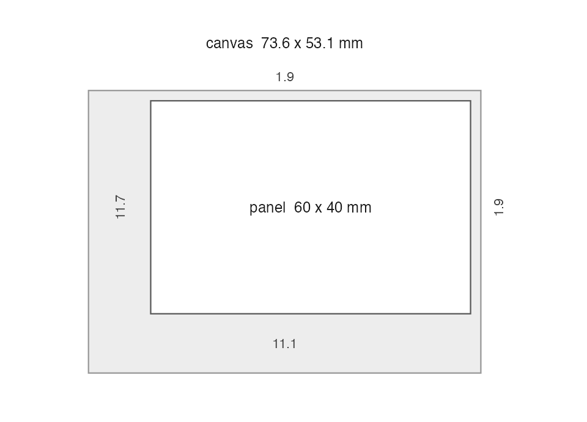

# Sizing figures by panel, not by canvas

Every figure has two widths, and the one you can normally set is not the
one a reader notices.

- The **canvas** is the image file. `ggsave(width = 85, units = "mm")`
  sets this.
- The **panel** is the plot area left over once the axis title, the tick
  labels, the tick marks, the legend and the margins have taken their
  share.

You set the canvas. The panel gets whatever is left. So a figure with
long tick labels has a smaller plot area than one with short labels,
even when both were saved at exactly the same width — and side by side
on a page, they look uneven. That mismatch is the most common reason a
set of figures looks unfinished, and it is invisible in the code.

figspec lets you set the panel instead, and works the canvas out for
you.

[`library`](https://rdrr.io/r/base/library.html)`(`[`figspec`](https://dansemakula.github.io/figspec/)`)`` `[`library`](https://rdrr.io/r/base/library.html)`(`[`ggplot2`](https://ggplot2.tidyverse.org)`)`

## The problem, in three figures

Three plots of the same data. They differ only in the magnitude of the y
values, which changes how wide the tick labels are.

`figs`` ``<-`` `[`list`](https://rdrr.io/r/base/list.html)`(`` `` fig1 ``=`` `[`ggplot`](https://ggplot2.tidyverse.org/reference/ggplot.html)`(``mtcars``, `[`aes`](https://ggplot2.tidyverse.org/reference/aes.html)`(``wt``, ``mpg``)``)`` ``+`` `[`geom_point`](https://ggplot2.tidyverse.org/reference/geom_point.html)`(``)``,`` `` fig2 ``=`` `[`ggplot`](https://ggplot2.tidyverse.org/reference/ggplot.html)`(``mtcars``, `[`aes`](https://ggplot2.tidyverse.org/reference/aes.html)`(``wt``, ``mpg`` ``*`` ``100000``)``)`` ``+`` `[`geom_point`](https://ggplot2.tidyverse.org/reference/geom_point.html)`(``)``,`` `` fig3 ``=`` `[`ggplot`](https://ggplot2.tidyverse.org/reference/ggplot.html)`(``mtcars``, `[`aes`](https://ggplot2.tidyverse.org/reference/aes.html)`(``wt``, ``mpg`` ``/`` ``100``)``)`` ``+`` `[`geom_point`](https://ggplot2.tidyverse.org/reference/geom_point.html)`(``)`` ``)`

Saved the usual way, all three are 85 mm wide — the single-column width
Cell Press asks for.
[`check_submission()`](https://dansemakula.github.io/figspec/reference/check_submission.md)
measures what that leaves for the plot area:

[`check_submission`](https://dansemakula.github.io/figspec/reference/check_submission.md)`(``figs``, ``"cell_press"``)`` ``#> `` ``#> ``──`` ``Submission check - Cell Press journals`` ``──────────────────────────────────────`` ``#> 3 figures checked`` ``#> `` ``#> ``✖`` fig1 single failed: Type size`` ``#> ``✖`` fig2 single failed: Type size`` ``#> ``✖`` fig3 single failed: Type size`` ``#> `` ``#> ``ℹ`` Plot areas differ by 8.8 mm across this set (fig2 62.4 mm, fig1 71.3 mm). No publisher requires them to match, so this is not a failure. To make them match, pass fig_panel_width() to fig_save().`` ``#> `` ``#> ``✖`` 3 figures would fail this journal.`` ``#> ``ℹ`` Some requirements are not on record for this journal, so they were not judged.`` ``#> ``Source:`` ``<https://www.cell.com/information-for-authors/figure-guidelines>`` ``#> (verified 2026-08-21)`

Same canvas, three different plot areas. Nothing here is wrong: every
figure meets the journal’s stated width. But the middle one has
millimetres less room to draw in, and on the printed page you can see
it.

Note how that is reported. **No publisher states a rule about panel
consistency, so figspec never calls it a failure.** It is an observation
about your figures, printed apart from the pass and fail lines and never
counted among them. A green tick against an invented rule would be the
same error as inventing the rule.

## Setting a panel width

[`fig_save()`](https://dansemakula.github.io/figspec/reference/fig_save.md)
takes `panel_width`. Give it a number and the plot area comes out that
size exactly, whatever the labels do:

`f`` ``<-`` `[`tempfile`](https://rdrr.io/r/base/tempfile.html)`(``fileext ``=`` ``".png"``)`` `` `[`fig_geometry`](https://dansemakula.github.io/figspec/reference/fig_geometry.md)`(`[`fig_save`](https://dansemakula.github.io/figspec/reference/fig_save.md)`(``f``, ``figs``$``fig1``, panel_width ``=`` ``62``)``)`` ``#> canvas_width_mm canvas_height_mm panel_width_mm panel_height_mm`` ``#> 1 75.61 56.71 62 43.69`` ``#> decoration_width_mm decoration_height_mm panels_across panels_down`` ``#> 1 13.61 13.02 1 1`` `[`fig_geometry`](https://dansemakula.github.io/figspec/reference/fig_geometry.md)`(`[`fig_save`](https://dansemakula.github.io/figspec/reference/fig_save.md)`(``f``, ``figs``$``fig2``, panel_width ``=`` ``62``)``)`` ``#> canvas_width_mm canvas_height_mm panel_width_mm panel_height_mm`` ``#> 1 84.25 63.18 62 50.16`` ``#> decoration_width_mm decoration_height_mm panels_across panels_down`` ``#> 1 22.25 13.02 1 1`

Both panels are 62 mm. The canvases differ, because the second figure
needs more room for its labels — which is the right way round. The panel
is what you care about; the canvas is the consequence.

## Making a set match

For a set, the panel width you can share is set by the figure with the
*least* room — the one with the longest tick labels.
[`fig_panel_width()`](https://dansemakula.github.io/figspec/reference/fig_panel_width.md)
measures every figure and returns the widest panel all of them can use:

`pw`` ``<-`` `[`fig_panel_width`](https://dansemakula.github.io/figspec/reference/fig_panel_width.md)`(``figs``, journal ``=`` ``"cell_press"``, format ``=`` ``"tiff"``)`` ``pw`` ``#> [1] 62.70178`` ``#> attr(,"per_figure")`` ``#> fig1 fig2 fig3 `` ``#> 71.33381 62.70178 68.74486`` `[`attr`](https://rdrr.io/r/base/attr.html)`(``pw``, ``"per_figure"``)`` ``#> fig1 fig2 fig3 `` ``#> 71.33381 62.70178 68.74486`

`fig2` is the binding constraint. Pass that number back to
[`fig_save()`](https://dansemakula.github.io/figspec/reference/fig_save.md)
and every figure comes out with the same plot area, still at the
journal’s 85 mm canvas — the slack goes to the margin rather than
stretching the panel:

`for`` ``(``nm`` ``in`` `[`names`](https://rdrr.io/r/base/names.html)`(``figs``)``)`` ``{`` `` `[`fig_save`](https://dansemakula.github.io/figspec/reference/fig_save.md)`(`[`file.path`](https://rdrr.io/r/base/file.path.html)`(`[`tempdir`](https://rdrr.io/r/base/tempfile.html)`(``)``, `[`paste0`](https://rdrr.io/r/base/paste.html)`(``nm``, ``".tiff"``)``)``, ``figs``[[``nm``]``]``,`` `` journal ``=`` ``"cell_press"``, panel_width ``=`` ``pw``)`` ``}`` `` `[`check_submission`](https://dansemakula.github.io/figspec/reference/check_submission.md)`(`[`lapply`](https://rdrr.io/r/base/lapply.html)`(``figs``, ``fig_panel_size``, width ``=`` ``pw``)``, ``"cell_press"``)`` ``#> `` ``#> ``──`` ``Submission check - Cell Press journals`` ``──────────────────────────────────────`` ``#> 3 figures checked`` ``#> `` ``#> ``✖`` fig1 single failed: Type size`` ``#> ``✖`` fig2 single failed: Type size`` ``#> ``✖`` fig3 single failed: Type size`` ``#> `` ``#> ``✔`` Plot areas match across this set (62.7 mm).`` ``#> `` ``#> ``✖`` 3 figures would fail this journal.`` ``#> ``ℹ`` Some requirements are not on record for this journal, so they were not judged.`` ``#> ``Source:`` ``<https://www.cell.com/information-for-authors/figure-guidelines>`` ``#> (verified 2026-08-21)`

## Letting the journal decide

If you only have one figure and simply want it to use its column as
fully as possible, `panel_width = "max"` takes the widest panel that
still fits:

[`fig_geometry`](https://dansemakula.github.io/figspec/reference/fig_geometry.md)`(`[`fig_save`](https://dansemakula.github.io/figspec/reference/fig_save.md)`(``f``, ``figs``$``fig1``, journal ``=`` ``"cell_press"``, panel_width ``=`` ``"max"``)``)`` ``#> Warning: 'Cell Press journals' does not list PNG among its accepted formats`` ``#> (TIFF, PDF, EPS, JPEG).`` ``#> Warning: Saved figure does not meet 1 requirement(s) of 'Cell Press journals':`` ``#> File format. Run fig_check() on the file for detail.`` ``#> canvas_width_mm canvas_height_mm panel_width_mm panel_height_mm`` ``#> 1 85 63.75 71.5 50.91`` ``#> decoration_width_mm decoration_height_mm panels_across panels_down`` ``#> 1 13.5 12.84 1 1`

Note that `"max"` is per figure. It gives *this* figure the largest
panel it can have, which is not the same as giving a *set* matching
panels — for that you want
[`fig_panel_width()`](https://dansemakula.github.io/figspec/reference/fig_panel_width.md)
above.

## Canvas and panel together

`width` and `panel_width` are not alternatives. They are two constraints
on one equation:

    canvas = panel + decoration

The third term is measured, not guessed, so figspec can solve for
whichever you leave out. Give both and both are honoured — the leftover
becomes margin:

[`fig_geometry`](https://dansemakula.github.io/figspec/reference/fig_geometry.md)`(`[`fig_save`](https://dansemakula.github.io/figspec/reference/fig_save.md)`(``f``, ``figs``$``fig1``, width ``=`` ``120``, panel_width ``=`` ``62``)``)`` ``#> canvas_width_mm canvas_height_mm panel_width_mm panel_height_mm`` ``#> 1 120 90 62 76.98`` ``#> decoration_width_mm decoration_height_mm panels_across panels_down`` ``#> 1 13.61 13.02 1 1`

Ask for a pair that cannot exist and it refuses, naming the two values
that would work. You cannot arrive at those without doing the
measurement, so the error carries them:

[`fig_save`](https://dansemakula.github.io/figspec/reference/fig_save.md)`(``f``, ``figs``$``fig1``, width ``=`` ``70``, panel_width ``=`` ``62``)`` ``#> ``Error```  in `solve_geometry()`: ``` ``#> ``!`` A 70 mm canvas cannot hold a 62 mm panel.`` ``#> ``ℹ`` The axes, legend and margins need 13.6 mm, which leaves 56.4 mm.`` ``#> ``•`` Widen the canvas to 75.6 mm, or`` ``#> ``•```  set `panel_width = 56.4`. ``

Under a journal, the column width pins the canvas — a figure that is not
the column width gets rescaled in production, and rescaling is what
drives type below the stated minimum. So an over-wide panel is refused
for the same reason:

[`fig_save`](https://dansemakula.github.io/figspec/reference/fig_save.md)`(``f``, ``figs``$``fig1``, journal ``=`` ``"cell_press"``, panel_width ``=`` ``200``)`` ``#> Warning: 'Cell Press journals' does not list PNG among its accepted formats`` ``#> (TIFF, PDF, EPS, JPEG).`` ``#> ``Error```  in `solve_geometry()`: ``` ``#> ``!`` A 85 mm canvas cannot hold a 200 mm panel.`` ``#> ``ℹ`` The axes, legend and margins need 13.5 mm, which leaves 71.5 mm.`` ``#> ``•`` Widen the canvas to 213.5 mm, or`` ``#> ``•```  set `panel_width = 71.5`. ``

## Facets and compositions

A panel width applies to *each* panel, which is what keeps panels
comparable between figures rather than between layouts. A three-facet
figure at 30 mm panels is three 30 mm panels wide, not 30 mm in total:

`faceted`` ``<-`` `[`ggplot`](https://ggplot2.tidyverse.org/reference/ggplot.html)`(``mtcars``, `[`aes`](https://ggplot2.tidyverse.org/reference/aes.html)`(``wt``, ``mpg``)``)`` ``+`` `[`geom_point`](https://ggplot2.tidyverse.org/reference/geom_point.html)`(``)`` ``+`` `[`facet_wrap`](https://ggplot2.tidyverse.org/reference/facet_wrap.html)`(``~``cyl``)`` `[`fig_geometry`](https://dansemakula.github.io/figspec/reference/fig_geometry.md)`(`[`fig_save`](https://dansemakula.github.io/figspec/reference/fig_save.md)`(``f``, ``faceted``, panel_width ``=`` ``30``)``)`` ``#> canvas_width_mm canvas_height_mm panel_width_mm panel_height_mm`` ``#> 1 107.48 80.61 30 61.63`` ``#> decoration_width_mm decoration_height_mm panels_across panels_down`` ``#> 1 17.48 18.98 3 1`

The same holds for a patchwork composition, measured through the
nesting.

## Setting a panel without saving

[`fig_panel_size()`](https://dansemakula.github.io/figspec/reference/fig_panel_size.md)
does the geometry and hands back a figure you can print, inspect or pass
on. It keeps the plot it was built from, so the result can still be
checked in full — type size, font and colour live on the plot, not on
the layout, and would otherwise be lost:

`sized`` ``<-`` `[`fig_panel_size`](https://dansemakula.github.io/figspec/reference/fig_panel_size.md)`(``figs``$``fig1``, width ``=`` ``62``, height ``=`` ``45``)`` `[`fig_geometry`](https://dansemakula.github.io/figspec/reference/fig_geometry.md)`(``sized``)`` ``#> `` ``#> ``──`` ``Figure geometry`` ``─────────────────────────────────────────────────────────────`` ``#> canvas 75.6 x 58.1 mm`` ``#> panel 62 x 45 mm`` ``#> `` ``#> ``Decoration`` - where the rest of the space goes`` ``#> left 11.7 mm`` ``#> bottom 11.1 mm`` ``#> right 1.9 mm`` ``#> top 1.9 mm`` ``#> `` ``#> ``ℹ```  `plot()` this to see it. ``

## What a figure is right now

[`fig_geometry()`](https://dansemakula.github.io/figspec/reference/fig_geometry.md)
reports where the space in a figure is going, which is usually the
fastest way to see why one is not the size you expected:

[`fig_geometry`](https://dansemakula.github.io/figspec/reference/fig_geometry.md)`(``figs``$``fig2``)`` ``#> `` ``#> ``──`` ``Figure geometry`` ``─────────────────────────────────────────────────────────────`` ``#> ``ℹ`` The panels have no size of their own yet, so they will take whatever the`` ``#> canvas leaves over. The decoration below is fixed by the labels and the`` ``#> font, and does not change with the canvas.`` ``#> `` ``#> ``Decoration`` - where the rest of the space goes`` ``#> left 20.6 mm`` ``#> bottom 11.3 mm`` ``#> right 1.9 mm`` ``#> top 1.9 mm`` ``#> `` ``#> ``ℹ```  `plot()` this to see it. ``

An unsized plot reports `NA` for its panel and canvas, and a real number
for its decoration. That is not a failure to measure — a panel with no
size of its own genuinely has no width until a canvas is chosen. The
decoration, which depends only on the labels and the font, is known
either way.

The per-side figures are usually what you want. A total tells you the
canvas has to grow; the sides tell you *why*, and they have different
fixes — a wide right margin is a legend to move, a wide left margin is
axis labels to shorten.

[`plot`](https://rdrr.io/r/graphics/plot.default.html)`(`[`fig_geometry`](https://dansemakula.github.io/figspec/reference/fig_geometry.md)`(`[`fig_panel_size`](https://dansemakula.github.io/figspec/reference/fig_panel_size.md)`(``figs``$``fig1``, width ``=`` ``60``, height ``=`` ``40``)``)``)`


